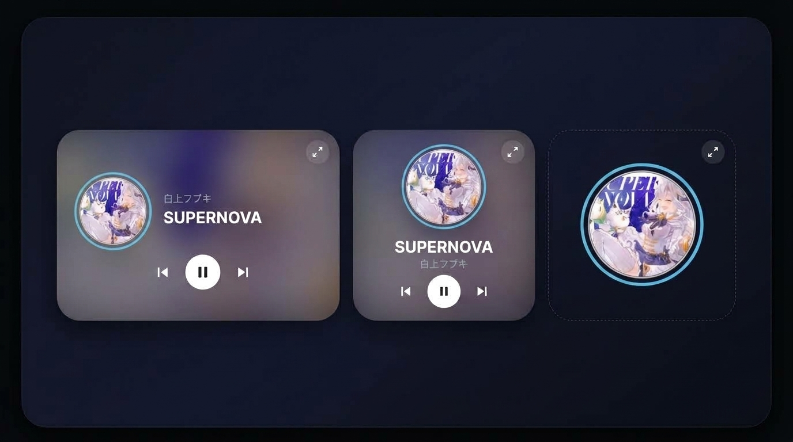
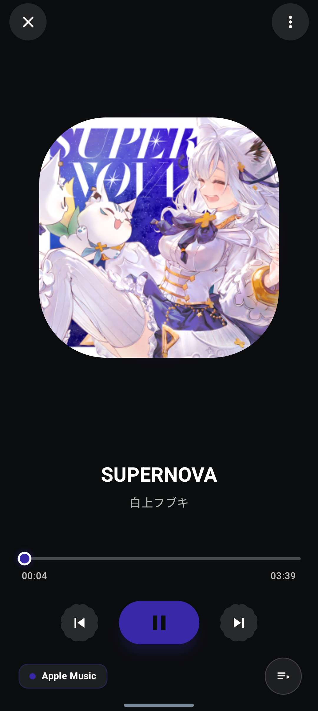
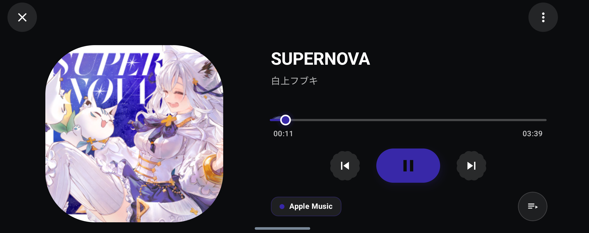

# hibiku

<p align="center">
  
</p>

<p align="center">
  <a href="https://developer.android.com/about/versions/16"></a>
  <a href="https://kotlinlang.org"></a>
  <a href="https://developer.android.com/jetpack/compose"></a>
  <a href="https://developer.android.com/jetpack/androidx/releases/glance"></a>
  <a href="LICENSE"></a>
</p>

---

## 🎧 Overview

**hibiku**는 Android 16 (API 36) 및 Android 17 (API 37) 환경을 타겟으로 설계된 모던 뮤직 플레이어 위젯 앱입니다.

Spotify, YouTube Music, Apple Music, Samsung Music 등 표준 `MediaSession`을 제공하는 모든 오디오 앱의 재생 상태와 앨범아트를
실시간으로 감지하여 홈 스크린에 미려한 위젯을 제공합니다. 위젯은 홈화면에서 자유롭게 리사이즈할 수 있으며, 크기에 따라 앨범아트·폰트·컨트롤 크기가 자동으로 비례 조정됩니다.

---

## ✨ Key Features

### 1. 3가지 스타일의 Glance 홈 위젯 (리사이즈 지원)

Jetpack Glance 기반의 3가지 위젯 레이아웃을 제공합니다. 모든 위젯은 `SizeMode.Exact`를 사용하여 홈화면에서 리사이즈 시 내부 요소가 비례적으로 자동
조정됩니다.

* **4x2 Standard Widget**: 원형 앨범아트와 엑센트 테두리, 곡명/아티스트, 이전곡/재생·일시정지/다음곡 컨트롤이 완비된 메인 위젯. 위젯 높이에 따라
  앨범아트·폰트·버튼 크기가 비례 확대/축소됩니다.
* **2x2 Standard Widget**: 원형 앨범아트와 엑센트 테두리, 텍스트 정보, 간결한 3버튼 컨트롤을 배치한 컴팩트 위젯. 짧은 변 길이 기준으로 내부 요소가 비례
  조정됩니다.
* **2x2 Pure Widget**: 배경 카드 없이 앨범아트와 엑센트 테두리만 투명하게 띄워 배경화면과 완벽하게 일체화되는 퓨어 스타일 위젯. 짧은 변의 85%를 앨범아트가
  채웁니다.

### 2. 위젯 클릭 동작

* **이머시브 버튼(우상단)**: 이머시브 플레이어 진입 (별도 구현 예정)
* **그 외 영역 전체**: 현재 재생 중인 음악 앱으로 바로 이동
    * `sessionActivity` → 재생 앱 패키지 직접 런치 → 자기 앱 순서로 fallback (YouTube Music 등 모든 앱 대응)

### 3. 원형 앨범아트 엑센트 테두리 & Palette/커스텀 컬러 연동

앨범아트 테두리와 위젯 스타일을 취향에 맞게 설정할 수 있습니다:

* **Android Palette 연동**: 앨범아트에서 지배적인 색상(Dominant / Vibrant)을 실시간 자동 추출하여 엑센트 테두리에 적용.
* **커스텀 HEX & 프리셋 컬러**: 원하는 테두리 색상을 자유롭게 지정 가능.
* **앨범아트 블러 배경 지원**: 위젯 카드 배경에 현재 앨범아트 블러 효과를 표출하여 고급스러운 시각적 깊이감 제공.

---

## 📸 Screenshots

### 홈 위젯 라인업 (4x2, 2x2 Standard, 2x2 Pure)


### 이머시브 화면

| 세로형                                     | 가로형                                      |
|-----------------------------------------|------------------------------------------|
|  |  |

---

## 🏗 Architecture & Modules

프로젝트는 명확한 관심사 분리(SoC)를 위해 멀티 모듈 아키텍처로 구성되어 있습니다:

```text
hibiku/
├── app/          # Application 진입점 및 의존성 주입 조립
├── core/         # 그래픽 렌더링(5종 링, 블러), Palette 추출, 유틸리티
├── domain/       # MediaPlaybackState, WidgetConfig, Repository 인터페이스
└── feature/      # Glance 위젯 3종, M3 환경설정 Activity, MediaService
```

* **`:domain`**: UI 및 플랫폼 의존성이 없는 순수 비즈니스 모델 및 재생 상태 계약.
* **`:core`**: 원형 앨범아트 엑센트 테두리 및 블러 렌더러 (`WidgetBitmapRenderer`), 앨범아트 팔레트 추출기 (
  `PaletteExtractor`).
* **`:feature`**:
    * `MediaNotificationListenerService`: 활성 MediaController 및 PlaybackState 자동 추적.
    * Glance 위젯 3종 (`MusicWidget4x2`, `MusicWidget2x2Standard`, `MusicWidget2x2Pure`) — 모두
      `SizeMode.Exact` 리사이즈 지원.
    * `WidgetConfigurationActivity`: Jetpack Compose 기반 위젯 커스텀 및 실시간 비트맵 렌더링 미리보기.

---

## 🚀 Getting Started

### 요구 사항

* Android Studio Ladybug (2024.2) 이상 또는 Meerkat 이상 권장
* JDK 17 / 21
* Android 16 (API 36) 이상 지원 기기 또는 에뮬레이터 (compileSdk 37, minSdk 36)

### 빌드 및 실행

```bash
# 디버그 APK 빌드
./gradlew assembleDebug

# 유닛 테스트 실행
./gradlew testDebugUnitTest
```

### 권한 안내

* **알림 접근 허용 (`NotificationListenerService`)**: 위젯이 음악 앱(Spotify, YouTube Music 등)의 오디오 메타데이터 및 재생
  컨트롤 세션을 연동하기 위해 '알림 접근 허용' 권한이 필요합니다. 앱 실행 시 안내 배너를 통해 원클릭으로 시스템 설정 화면으로 이동할 수 있습니다.

---

## 📄 License

이 프로젝트는 [MIT License](LICENSE) 하에 오픈소스로 제공됩니다.

```text
Copyright (c) 2026 windsekirun
```
