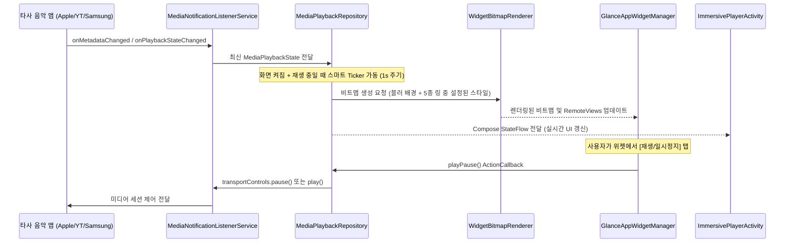

# Android 16-17 미디어 홈 위젯 및 이머시브 플레이어 설계서

## 1. 개요 (Overview)

본 프로젝트는 Android 16 ~ 17(API 36~37) 환경에서 애플 뮤직(Apple Music), 유튜브 뮤직(YouTube Music), 삼성 뮤직(Samsung Music) 등 안드로이드 표준 `MediaSession`을 사용하는 모든 음악 앱과 연동되는 **Jetpack Glance 기반 홈 위젯 시스템**과 **가로 모드 전용 이머시브 스탠바이(StandBy) 플레이어**를 제공합니다.

### 핵심 목표
1. **타사 미디어 세션 호환성**: 시스템 `NotificationListenerService` 및 `MediaSessionManager`를 통한 무설정 세션 자동 감지 및 제어.
2. **Glance 기반 3종 위젯 라인업**:
   - **4x2 표준 위젯**: 원형 앨범아트 + 둘레 프로그레스 링(좌), 곡명/아티스트(우상단), 이전/재생/다음 컨트롤(우하단), 블러 배경.
   - **2x2 기본 위젯**: 상단 앨범아트+프로그레스 링, 중앙 곡 정보, 하단 미니 컨트롤러의 수직 스택.
   - **2x2 미니멀 위젯**: 텍스트를 배제하고 대형 원형 앨범아트와 프로그레스 링, 필수 컨트롤에 집중한 아트워크 중심형.
3. **5가지 프로그레스 링 스타일 커스텀**:
   - 물결 웨이브 (Squiggly Wave)
   - 플로팅 듀얼 링 (Floating Clean)
   - 세그먼트 도트 (Segmented Minimal)
   - 글로우 썸 링 (Glow Thumb)
   - 솔리드 클래식 (Solid Classic)
4. **위젯 설정 화면 (Configuration Activity)**:
   - 위젯별(`appWidgetId`) 독립 설정 저장.
   - 5종 링 스타일 선택, Material You 다이내믹 컬러, 프리셋 팔레트, 커스텀 HEX/HSV 컬러 피커, 실시간 라이브 미리보기.
5. **가로 전용 이머시브 스탠바이 모드 (Immersive StandBy Player)**:
   - 태블릿/폴더블/스마트폰 거치 시 동작하는 풀스크린 앰비언트 플레이어.
   - 유기적 아티스틱 마스크 앨범아트 + Material 3 볼드 컨트롤 및 물결 탐색바(Squiggly Seekbar).
   - 트리거: 위젯 내 전용 버튼/탭 동작 및 (충전 중 + 가로 거치 시) 자동 실행 지원.

---

## 2. 시스템 아키텍처 (Architecture)

```
+-----------------------------------------------------------------------------------+
|                           Android System & Media Apps                             |
|  (Apple Music / YouTube Music / Samsung Music / Spotify 등 Active MediaSessions)  |
+-----------------------------------------+-----------------------------------------+
                                          | MediaSession / PlaybackState / Metadata
                                          v
+-----------------------------------------------------------------------------------+
|                        MediaNotificationListenerService                           |
|    - MediaSessionManager.OnActiveSessionsChangedListener                          |
|    - MediaController.Callback (onPlaybackStateChanged, onMetadataChanged)          |
+-----------------------------------------+-----------------------------------------+
                                          |
                                          v
+-----------------------------------------------------------------------------------+
|                         MediaPlaybackRepository (Singleton)                       |
|    - StateFlow<MediaPlaybackState> 방출                                           |
|    - TransportControls 액션 중계 (playPause, skipToNext, skipToPrevious, seekTo)   |
|    - ScreenStateReceiver 연동 (화면 켜짐 + 재생 중에만 1~2초 스마트 갱신 Ticker)    |
+-------------------+---------------------------------------+-----------------------+
                    |                                       |
                    v                                       v
+------------------------------------+  +-------------------------------------------+
|       Glance Home Widgets          |  |         Immersive StandBy Mode            |
| - MusicWidget4x2                   |  | (ImmersivePlayerActivity)                 |
| - MusicWidget2x2Standard           |  | - 가로 전용 풀스크린 앰비언트 UI          |
| - MusicWidget2x2Minimal            |  | - 아티스틱 마스크 앨범아트               |
| - WidgetBitmapRenderer (블러/링)   |  | - M3 볼드 컨트롤 & 물결 탐색바            |
| - WidgetPreferencesRepository      |  | - 트리거: 위젯 아이콘 탭 or 충전+가로거치 |
+------------------------------------+  +-------------------------------------------+
```

---

## 3. 세부 컴포넌트 설계

### 3.1. 미디어 세션 감지 및 제어 레이어
- **`MediaNotificationListenerService`**
  - `android.service.notification.NotificationListenerService` 상속.
  - `MediaSessionManager`를 획득하여 활성 세션 목록 추적.
  - 현재 오디오를 재생 중인 최우선 세션을 활성 컨트롤러로 선정.
  - 알림 접근 권한(`BIND_NOTIFICATION_LISTENER_SERVICE`) 필요.
- **`MediaPlaybackState`**
  ```kotlin
  data class MediaPlaybackState(
      val isPlaying: Boolean = false,
      val title: String = "",
      val artist: String = "",
      val albumArt: Bitmap? = null,
      val positionMs: Long = 0L,
      val durationMs: Long = 0L,
      val packageName: String? = null,
      val sessionActivity: PendingIntent? = null
  ) {
      val progress: Float
          get() = if (durationMs > 0L) (positionMs.toFloat() / durationMs).coerceIn(0f, 1f) else 0f
  }
  ```
- **`ScreenStateReceiver` & 스마트 배터리 Ticker**
  - 화면이 켜진 상태(`SCREEN_ON`)이며 미디어가 실제 재생 중(`isPlaying == true`)일 때만 코루틴 타이머가 동작하여 1초~1.5초 간격으로 진행률을 계산하고 위젯을 리프레시.
  - 화면이 꺼지거나(`SCREEN_OFF`) 일시정지되면 즉시 Ticker Job을 취소하여 불필요한 IPC 및 배터리 낭비 완전 차단.

---

### 3.2. 비트맵 그래픽 렌더러 (`WidgetBitmapRenderer`)
위젯 렌더링에 필요한 Canvas 연산 및 이미지 이펙트 처리 담당:
1. **배경 블러 처리**:
   - 앨범아트 비트맵을 위젯 비율(가로세로)에 맞춰 `centerCrop`.
   - Android 16/17 내장 API (`RenderEffect.createBlurEffect(radius = 25f)` 또는 고속 캔버스 블러 알고리즘) 적용.
   - 텍스트 시인성 확보를 위해 30~40% 반투명 딤(Dim) 레이어 합성.
   - 앨범아트가 없을 경우: 완전 투명 배경 + 설정된 색상의 미니멀 라운드 테두리(stroke) 렌더링.
2. **원형 앨범아트 + 5종 프로그레스 링 렌더링**:
   - 앨범아트가 있을 때: 원형 마스크(`SRC_IN`)로 크롭.
   - 앨범아트가 없을 때: 기본 음악 음표 벡터 아이콘을 중앙에 배치.
   - **5가지 링 스타일**:
     1. **Squiggly Wave**: 진행 구간에 `Math.sin` 기반의 원형 사인파 물결 궤적을 렌더링. 정지 시 매끄러운 단색 링으로 전환.
     2. **Floating Clean**: 앨범아트 둘레의 미세한 흰색 라인 + 간격(gap) + 외곽 라운드 캡(`Paint.Cap.ROUND`) 프로그레스 링.
     3. **Segmented Minimal**: 일정 각도마다 정밀하게 쪼개진 대시/도트 세그먼트 눈금 링.
     4. **Glow Thumb**: 진행 바 끝점에 소프트 앰비언트 글로우 닷 포인트 렌더링.
     5. **Solid Classic**: 앨범아트 둘레에 직접 밀착된 일체형 클래식 원형 스트로크 링.

---

### 3.3. Glance 위젯 3종
`androidx.glance:glance-appwidget:1.1.1` 기반 컴포넌트:

1. **`MusicWidget4x2` (표준 4x2 위젯)**
   - 가로형 2단 구조:
     - 좌측: 비트맵 렌더러가 생성한 [원형 앨범아트 + 프로그레스 링] (탭 시 해당 음악 앱 실행)
     - 우측 상단: 아티스트명, 곡명 (탭 시 해당 음악 앱 실행)
     - 우측 하단: 이전곡, 재생/일시정지, 다음곡 버튼
   - 배경: 블러 앨범아트 또는 투명 테두리

2. **`MusicWidget2x2Standard` (기본 2x2 위젯)**
   - 수직형 3단 구조:
     - 상단: 원형 앨범아트 + 프로그레스 링
     - 중앙: 곡 제목 & 아티스트명
     - 하단: 이전곡, 재생/일시정지, 다음곡 버튼

3. **`MusicWidget2x2Minimal` (미니멀 텍스트리스 2x2 위젯)**
   - 대형 아트워크 중심 구조:
     - 중앙: 화면의 대부분을 차지하는 큼직한 원형 앨범아트 + 프로그레스 링
     - 하단/오버레이: 미니멀 이전곡 / 재생/일시정지 / 다음곡 컨트롤

---

### 3.4. 위젯 설정 화면 (`WidgetConfigurationActivity`)
- 위젯을 홈 화면에 배치할 때 자동 실행되며, 설정 변경을 위해 언제든 재진입 가능.
- **주요 UI 섹션**:
  - **실시간 라이브 프리뷰**: 현재 재생 음악(또는 기본 샘플)에 설정값이 즉시 반영된 위젯 미리보기.
  - **링 스타일 선택기**: 5가지 스타일을 시각적 카드로 제공.
  - **색상 커스텀**:
    - Material You 다이내믹 컬러(시스템 테마 색상 연동) 스위치
    - 프리셋 컬러 팔레트 (화이트, 소프트 블루, 네온 퍼플, 민트, 코랄, 앰버 등)
    - 커스텀 컬러 피커 (HEX 코드 입력 및 슬라이더)
  - **권한 상태 안내 카드**: 알림 접근 권한 미허용 시 시스템 설정으로 연결하는 안내 버튼 제공.
- **저장소 (`WidgetPreferencesRepository`)**:
  - Android Jetpack DataStore / SharedPreferences를 통해 `appWidgetId`별 개별 설정 격리 저장.

---

### 3.5. 세로/가로 반응형 이머시브 플레이어 (`ImmersivePlayerActivity`)
- **디자인 컨셉**: 태블릿, 거치대 또는 침대 머리맡/손안에서 탁상 시계 또는 풀스크린 감상 모드로 즐기는 고품격 앰비언트 플레이어.
- **화면 회전 잠금 무시 & 센서 연동**:
  - 시스템 설정에서 '화면 자동 회전'이 잠겨(Lock) 있더라도 `requestedOrientation = ActivityInfo.SCREEN_ORIENTATION_FULL_SENSOR`를 적용하여 사용자가 기기를 회전하면 물리 센서를 감지해 가로/세로 레이아웃으로 즉각 전환.
  - 액티비티 종료 시 시스템 설정에 영향 없음.
- **반응형 UI 레이아웃 (Compose 기반)**:
  - **가로 모드 (Landscape)**:
    - 좌측: 420dp급 대형 아티스틱 마스크 앨범아트 (8자형 오가닉 / 모핑 페블 / LP 바이닐 / 스쿼클).
    - 우측: 트랙 타이틀/아티스트, M3 볼드 Pill 재생 버튼, 스캘럽(12각 별모양) 이전/다음 버튼, Squiggly 물결 탐색바, 오디오 출력 장치 칩.
  - **세로 모드 (Portrait)**:
    - 상단: 290dp급 아티스틱 마스크 앨범아트.
    - 하단: 트랙 타이틀/아티스트 및 볼드 컨트롤 대시보드 수직 정렬.
  - **배경**: 올레드 친화적 딥 블랙 (#0b0c0e) + 앨범아트 색상 기반의 은은한 앰비언트 방사형 블러 글로우.
  - **화면 유지**: `FLAG_KEEP_SCREEN_ON` 적용으로 감상 중 화면 꺼짐 방지.
- **디자인 컨셉**: 태블릿, 거치대 또는 침대 머리맡에서 탁상 시계/스탠바이 오디오 모드로 감상할 수 있는 고품격 풀스크린 플레이어.
- **UI 레이아웃 (Compose 기반)**:
  - **좌측**: 유기적인 아티스틱 마스크 형태(8자형 / 오가닉 스쿼클 / 원형 LP 스타일)의 대형 앨범아트.
  - **우측**:
    - 대형 텍스트: 현재 곡명, 아티스트명.
    - 컨트롤 대시보드: M3 볼드 Pill 형태의 대형 재생 버튼, 별모양/스캘럽(Scallop) 형태의 이전/다음곡 버튼.
    - 물결 타임라인: 현재 시간에 맞춰 출렁이는 Squiggly Seekbar와 시작/총 재생 시간.
    - 출력 디바이스 칩 (예: Phone Speaker, Bluetooth Earbuds 등).
  - **배경**: 올레드 친화적 딥 블랙 또는 은은한 앰비언트 백그라운드 블러.
  - **화면 유지**: `FLAG_KEEP_SCREEN_ON` 적용으로 감상 중 화면 꺼짐 방지.
- **실행 트리거**:
  1. **위젯 연동**: 위젯에 배치된 미니 이머시브 확장 아이콘 탭 또는 위젯 탭 동작 설정.
  2. **스탠바이 자동 실행**: `PowerConnectionReceiver`를 통해 (음악 재생 중) + (충전기 연결됨) + (가로 거치 감지) 시 설정 옵션에 따라 자동으로 이머시브 화면 실행.

---

## 4. 데이터 흐름 및 상태 머신



---

## 5. 예외 처리 및 성능 최적화

1. **TransactionTooLargeException 방지**:
   - 위젯 RemoteViews로 전달되는 비트맵은 위젯 dp 크기(예: 4x2 기준 약 360x180dp)에 정밀하게 다운샘플링하여 메모리 전송 한도(1MB)를 절대 초과하지 않도록 보장합니다.
2. **배터리 수명 극대화**:
   - 화면이 꺼지면 Ticker 코루틴 즉시 정지.
   - 재생 정지/세션 종료 시 Ticker 즉시 정지.
3. **알림 접근 권한 미허용 처리**:
   - 권한이 없는 경우 위젯에 "터치하여 설정" 안내 카드 표시 및 원클릭 설정 이동 유도.
4. **미디어 재생 중이 아닐 때의 대체 UI**:
   - 기본 음악 아이콘 + "재생 중인 음악이 없습니다" 문구와 함께 반투명 테두리 표시.

---

## 6. 검증 계획 (Verification Plan)

### 6.1. 자동화 테스트
- `MediaPlaybackState`의 진행률(`progress`) 계산 단위 테스트.
- 5종 링 스타일의 각도(`sweepAngle`) 및 물결 파형 포인트 생성 로직 단위 테스트.
- `WidgetPreferencesRepository`의 설정 저장 및 읽기 테스트.

### 6.2. 수동 및 실기기 검증
- **애플 뮤직 / 유튜브 뮤직 / 삼성 뮤직 실시간 연동 검증**:
  - 각 앱에서 재생, 일시정지, 다음곡, 이전곡, 탐색 시 위젯 즉시 반응 확인.
- **3종 위젯 레이아웃 확인**:
  - 4x2 표준, 2x2 기본, 2x2 미니멀 각각 홈 화면에 배치 후 레이아웃 정상 출력 확인.
- **5종 링 스타일 변경 및 색상 커스텀 검증**:
  - 위젯 설정 화면에서 스타일 및 색상 변경 시 해당 위젯에 즉시 반영되는지 확인.
- **가로 모드 이머시브 스탠바이 플레이어 검증**:
  - 위젯 아이콘 탭 및 충전+가로 거치 시 풀스크린 UI가 정상 실행되고 컨트롤 및 물결바가 동작하는지 확인.
