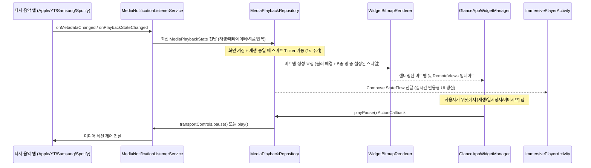

# hibiku (Android 16-17 미디어 홈 위젯 및 이머시브 플레이어) 설계서

## 1. 개요 (Overview)

본 프로젝트 **hibiku**는 Android 16 ~ 17(API 36~37) 환경에서 애플 뮤직(Apple Music), 유튜브 뮤직(YouTube Music), 삼성 뮤직(Samsung Music), 스포티파이(Spotify) 등 안드로이드 표준 `MediaSession`을 사용하는 모든 음악 앱과 연동되는 **Jetpack Glance 기반 홈 위젯 시스템**과 **센서 연동 반응형 이머시브 스탠바이(StandBy) 플레이어**를 제공합니다.

### 핵심 목표
1. **타사 미디어 세션 호환성**: 시스템 `NotificationListenerService` 및 `MediaSessionManager`를 통한 무설정 세션 자동 감지 및 제어.
2. **Glance 기반 4종 위젯 라인업**:
   - **4x2 표준 위젯 (`MusicWidget4x2`)**: 원형 앨범아트 + 둘레 프로그레스 링(좌), 곡명/아티스트(우상단), 이전/재생/다음 컨트롤(우하단), 이머시브 진입 버튼, 블러 배경.
   - **2x2 기본 위젯 (`MusicWidget2x2Standard`)**: 상단 앨범아트+프로그레스 링, 중앙 곡 제목(아티스트는 가독성을 위해 생략), 우측 상단 이머시브 버튼, 하단 미니 컨트롤러의 수직 스택.
   - **2x2 미니멀 위젯 (`MusicWidget2x2Minimal`)**: 대형 원형 앨범아트 + 프로그레스 링 중심. 앨범아트 탭 시 반투명 딤 오버레이에 미니 이전/재생/다음 및 이머시브 버튼이 토글 표시되는 아트워크 중심형.
   - **2x2 퓨어 위젯 (`MusicWidget2x2Pure`)**: 배경 박스나 텍스트 없이 오직 투명 캔버스 위에 원형 앨범아트와 프로그레스 링만 존재하는 극도의 미니멀 위젯.
3. **5가지 프로그레스 링 스타일 커스텀**:
   - 물결 웨이브 (Squiggly Wave)
   - 플로팅 클린 (Floating Clean)
   - 세그먼트 미니멀 (Segmented Minimal)
   - 글로우 썸 (Glow Thumb)
   - 솔리드 클래식 (Solid Classic)
4. **위젯 설정 화면 (Configuration Activity)**:
   - 위젯별(`appWidgetId`) 독립 설정 저장.
   - 5종 링 스타일 선택, Palette 기반 앨범아트 색상 자동 추출(Material You 연동), 프리셋 팔레트, 커스텀 HEX 컬러 피커, 실시간 라이브 미리보기.
5. **센서 연동 반응형 이머시브 스탠바이 모드 (`ImmersivePlayerActivity`)**:
   - 회전 잠금 상태에서도 물리 센서 감지(`SCREEN_ORIENTATION_FULL_SENSOR`)로 세로/가로 즉각 반응.
   - 4종 아티스틱 마스크 앨범아트 (Scallop, Squircle, Pebble, Vinyl LP) + M3 볼드 컨트롤 및 물결 탐색바(Squiggly Seekbar).
   - 5버튼 풀 컨트롤: 셔플(Shuffle) 토글, 이전곡, 대형 Pill 재생/일시정지, 다음곡, 반복(Repeat) 토글.
   - 트리거: 위젯 내 전용 버튼/탭 동작 및 (충전 중 + 거치 시) `PowerConnectionReceiver` 자동 실행.
6. **모든 컴포저블의 UI Preview 탑재**:
   - 향후 유지보수 및 디자인 수정을 위해 설정 화면, 위젯 카드, 이머시브 플레이어, 물결바 등의 모든 Compose 컴포넌트에 `@Preview` 기본 구현.

---

## 2. 시스템 아키텍처 (Architecture)

```
+-----------------------------------------------------------------------------------+
|                           Android System & Media Apps                             |
|  (Apple Music / YouTube Music / Samsung Music / Spotify 등 Active MediaSessions)  |
+-----------------------------------------+-----------------------------------------+
                                          | MediaSession / PlaybackState / Metadata
                                          v
+-----------------------------------------------------------------------------------+
|                        MediaNotificationListenerService                           |
|    - MediaSessionManager.OnActiveSessionsChangedListener                          |
|    - MediaController.Callback (onPlaybackStateChanged, onMetadataChanged)          |
+-----------------------------------------+-----------------------------------------+
                                          |
                                          v
+-----------------------------------------------------------------------------------+
|                         MediaPlaybackRepository (Singleton)                       |
|    - StateFlow<MediaPlaybackState> 방출 (곡 정보, 재생상태, 셔플/반복 모드)         |
|    - TransportControls 액션 중계 (playPause, skipToNext, skipToPrevious, seekTo,  |
|      setShuffleMode, setRepeatMode)                                               |
|    - ScreenStateReceiver 연동 (화면 켜짐 + 재생 중에만 1~2초 스마트 갱신 Ticker)    |
+-------------------+---------------------------------------+-----------------------+
                    |                                       |
                    v                                       v
+------------------------------------+  +-------------------------------------------+
|       Glance Home Widgets          |  |         Immersive StandBy Mode            |
| - MusicWidget4x2                   |  | (ImmersivePlayerActivity)                 |
| - MusicWidget2x2Standard           |  | - Full Sensor 세로/가로 반응형 UI         |
| - MusicWidget2x2Minimal (Dim 탭)   |  | - 4종 아티스틱 마스크 앨범아트            |
| - MusicWidget2x2Pure (투명 링)     |  | - 5버튼 컨트롤 (셔플/이전/재생/다음/반복) |
| - WidgetBitmapRenderer (블러/링)   |  | - Squiggly 물결 탐색바 & Palette 글로우   |
| - WidgetPreferencesRepository      |  | - 트리거: 위젯 버튼 or 충전+거치 감지     |
+------------------------------------+  +-------------------------------------------+
```

---

## 3. 세부 컴포넌트 설계

### 3.1. 모듈 구조 (Multi-module Architecture)
- `:domain`: POJO 모델 (`MediaPlaybackState`, `RingStyle`, `M3ShapeStyle`, `WidgetConfig`) 및 리포지토리 인터페이스.
- `:core`: 비트맵 렌더러 (`WidgetBitmapRenderer`), 링 수학 계산 엔진 (`RingMathHelper`), 색상 추출기 (`PaletteExtractor`).
- `:feature`: 서비스 (`MediaNotificationListenerService`), 배터리 최적화 티커 (`PlaybackTicker`), Glance 위젯 4종, 설정 화면 (`WidgetConfigurationActivity`), 이머시브 플레이어 (`ImmersivePlayerActivity`).
- `:app`: 엔트리포인트 및 권한 가이드 액티비티 (`MainActivity`).

### 3.2. 미디어 세션 감지 및 제어 레이어
- **`MediaNotificationListenerService`**
  - `android.service.notification.NotificationListenerService` 상속.
  - `MediaSessionManager`를 획득하여 활성 세션 목록 실시간 추적.
  - 현재 오디오를 재생 중인 최우선 세션을 활성 컨트롤러로 선정.
  - 재생 정보, 메타데이터, 셔플(`isShuffleEnabled`), 반복(`repeatMode`) 상태 변경을 감지하여 리포지토리에 전파.
- **`MediaPlaybackState`**
  ```kotlin
  data class MediaPlaybackState(
      val isPlaying: Boolean = false,
      val title: String = "",
      val artist: String = "",
      val albumArt: Bitmap? = null,
      val positionMs: Long = 0L,
      val durationMs: Long = 0L,
      val packageName: String? = null,
      val sessionActivity: PendingIntent? = null,
      val isShuffleEnabled: Boolean = false,
      val repeatMode: Int = 0 // 0: None, 1: All, 2: One
  ) {
      val progress: Float
          get() = if (durationMs > 0L) (positionMs.toFloat() / durationMs).coerceIn(0f, 1f) else 0f
  }
  ```
- **`ScreenStateReceiver` & 스마트 배터리 Ticker (`PlaybackTicker`)**
  - 화면이 켜진 상태(`SCREEN_ON`)이며 미디어가 실제 재생 중(`isPlaying == true`)일 때만 코루틴 타이머가 1초~1.5초 간격으로 진행률을 계산하고 위젯을 리프레시.
  - 화면이 꺼지거나(`SCREEN_OFF`) 일시정지되면 즉시 Ticker Job을 취소하여 불필요한 IPC 및 배터리 소모 차단.

---

### 3.3. 비트맵 그래픽 렌더러 (`WidgetBitmapRenderer`)
위젯 렌더링에 필요한 Canvas 연산 및 이미지 이펙트 처리 담당:
1. **배경 블러 처리**:
   - 앨범아트 비트맵을 위젯 비율에 맞춰 `centerCrop`.
   - Android 고속 캔버스 블러 알고리즘 적용 및 텍스트 시인성을 위한 반투명 딤(Dim) 레이어 합성.
   - 앨범아트가 없을 경우: 투명 배경 + 설정 색상 라운드 스트로크 렌더링.
2. **원형 앨범아트 + 5종 프로그레스 링 렌더링**:
   - 앨범아트가 있을 때: 원형 마스크(`SRC_IN`)로 크롭. 없을 때 기본 음표 벡터 렌더링.
   - **5가지 링 스타일**:
     1. **Squiggly Wave**: 재생 시 `Math.sin` 기반 원형 사인파 물결 궤적 렌더링, 일시정지 시 매끄러운 단색 링으로 전환.
     2. **Floating Clean**: 앨범아트 둘레의 흰색 라인 + 간격(gap) + 외곽 라운드 캡 프로그레스 링.
     3. **Segmented Minimal**: 일정 각도마다 정밀하게 나뉜 대시/도트 세그먼트 눈금 링.
     4. **Glow Thumb**: 진행 바 끝점에 소프트 앰비언트 글로우 닷 포인트 렌더링.
     5. **Solid Classic**: 앨범아트 둘레에 직접 밀착된 일체형 클래식 원형 스트로크 링.

---

### 3.4. Glance 위젯 4종 라인업

1. **`MusicWidget4x2` (표준 4x2 위젯)**
   - 좌측: [원형 앨범아트 + 프로그레스 링] (탭 시 음악 앱 실행).
   - 우측 상단: 아티스트명, 곡 제목 및 우측 상단 미니 이머시브 진입 버튼.
   - 우측 하단: 이전곡, 재생/일시정지, 다음곡 컨트롤.
   - 배경: 블러 처리된 앨범아트 배경.

2. **`MusicWidget2x2Standard` (기본 2x2 위젯)**
   - 상단: 원형 앨범아트 + 프로그레스 링.
   - 우측 상단: 이머시브 진입 버튼.
   - 중앙: 곡 제목 (컨트롤과의 시각적 겹침 방지를 위해 아티스트명 생략).
   - 하단: 이전곡, 재생/일시정지, 다음곡 컨트롤.

3. **`MusicWidget2x2Minimal` (미니멀 텍스트리스 2x2 위젯)**
   - 대형 원형 앨범아트 + 둘레 프로그레스 링 중심 구조.
   - **오버레이 토글 인터랙션**: 앨범아트를 탭하면 어두운 반투명 딤 레이어 위에 미니 이전곡/재생/다음곡 및 상단 이머시브 버튼이 표시되며, 재탭 시 숨김.

4. **`MusicWidget2x2Pure` (퓨어 투명 2x2 위젯)**
   - 외부 카드 배경, 불투명 서피스, 텍스트 일체 배제.
   - 투명 캔버스 위에 순수한 원형 앨범아트와 둘레 프로그레스 링만 플로팅되는 극도의 미니멀리즘 디자인.
   - 탭 시 이머시브 플레이어 혹은 음악 앱 실행.

---

### 3.5. 위젯 설정 화면 (`WidgetConfigurationActivity`)
- 홈 화면에 위젯 추가 시 또는 액티비티 재진입 시 실행.
- **실시간 라이브 프리뷰**: 설정값 변경 시 즉시 상단 프리뷰 카드에 실시간 반영.
- **링 스타일 선택기**: 5가지 스타일(물결, 플로팅, 세그먼트, 글로우, 솔리드) 시각적 카드 선택.
- **색상 커스텀**:
  - Material You 앨범아트 색상 자동 추출 토글
  - 프리셋 팔레트 (화이트, 후부키 스카이블루, 골드, 네온퍼플, 민트, 코랄 등)
  - 커스텀 HEX 코드 입력 필드
- **저장소 (`WidgetPreferencesRepository`)**: `appWidgetId`별 SharedPreferences 격리 저장.

---

### 3.6. 센서 연동 반응형 이머시브 스탠바이 플레이어 (`ImmersivePlayerActivity`)

- **회전 잠금 무시 센서 연동**:
  - `requestedOrientation = ActivityInfo.SCREEN_ORIENTATION_FULL_SENSOR`를 적용하여 시스템 회전 잠금 상태와 무관하게 사용자의 기기 거치 방향에 맞춰 세로/가로 자동 회전.
- **반응형 듀얼 레이아웃**:
  - **가로 모드 (Landscape StandBy)**: 좌측 대형 아티스틱 마스크 앨범아트 + 우측 트랙 메타데이터, 5버튼 컨트롤(셔플, 이전, 대형 볼드 Pill 재생, 다음, 반복), Squiggly 물결 탐색바, 오디오 출력 장치 칩.
  - **세로 모드 (Portrait Fullscreen)**: 상단 290dp급 아티스틱 마스크 앨범아트 + 하단 곡 정보, Squiggly 탐색바, 5버튼 컨트롤 정렬.
- **4종 아티스틱 앨범 마스크 (`ArtisticAlbumMasks`)**:
  - 12-point Scallop (별꽃 형태)
  - Morphing Pebble (자연스러운 조약돌 형태)
  - Organic Squircle (부드러운 라운드 스쿼클)
  - Classic Vinyl LP (바이닐 레코드 형태)
- **Palette 컬러 추출 & 앰비언트 글로우**:
  - 앨범아트 비트맵에서 주요 색상을 추출하여 볼드 Pill 재생 버튼, Squiggly 물결바, 배경 방사형 글로우에 연동.
- **트리거**:
  - 위젯 내 이머시브 아이콘 탭
  - `PowerConnectionReceiver`: 충전기 연결 + 가로 거치 시 자동 실행 옵션.

---

## 4. 데이터 흐름



---

## 5. 최적화 및 안정성 보장

1. **TransactionTooLargeException 방어**:
   - Glance RemoteViews로 전달되는 모든 비트맵은 위젯 실제 치수(dp × density)에 맞춰 정확하게 다운샘플링하여 바인더 트랜잭션 용량 한도(1MB)를 절대 초과하지 않도록 보장.
2. **배터리 최적화**:
   - `ScreenStateReceiver`를 통해 화면이 꺼지면 Ticker 코루틴 즉각 중단.
   - 미디어 재생 정지 시 즉각 중단.
3. **무경고 및 클린 코드 준수**:
   - Glance 레이아웃과 Compose 레이아웃 임포트 충돌 방지를 위해 Glance 컴포넌트는 `GlanceSpacer`, `GlanceBox`, `GlanceRow`, `GlanceColumn`의 명시적 별칭 사용.
   - FQCN(Full Qualified Class Name)을 배제하고 표준 임포트 구조 유지.
